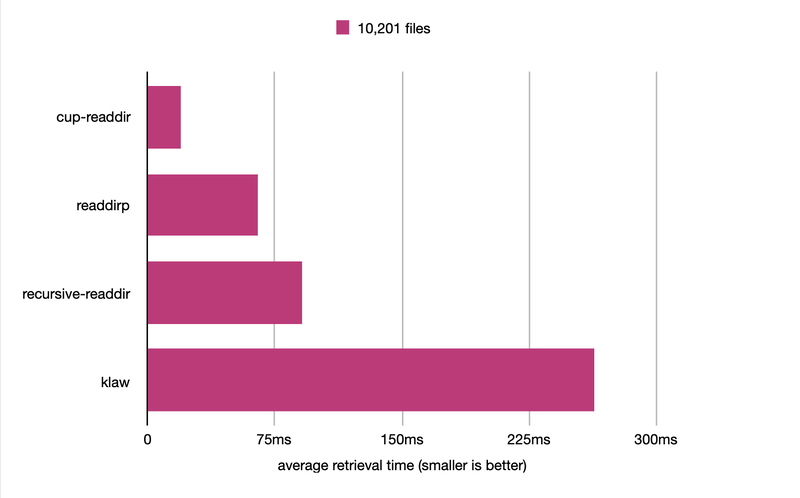

# cup-readdir

efficient way to get an array of all file paths from directory

## Installing

```sh
npm i cup-readdir
```

## Usage

#### `getAllFilePaths(dir)`
- returns a `<Promise>`

```js
const cupreaddir = require('cup-readdir')

cupreaddir.getAllFilePaths('path/to/dir').then(filepaths => console.log(filepaths))
```

This function returns a promise which will be resolved with an array of all file paths found recursively in the directory `dir`(`<string>`) *excluding*  directory names.

#### `sort(filepaths, property[, descendingOrder])`
- returns an array of `<FileInfo>` objects

```js
const cupreaddir = require('cup-readdir')

// sort by ascending file size
cupreaddir.getAllFilePaths('path/to/dir').then(filepaths => {
  return cupreaddir.sort(filepaths, 'size')
})
.then(fileInfoArray => {
  let result = fileInfoArray.map(f => `path: ${f.url} size: ${f.size}`)
  console.log(result)
})
```

This function takes in an array of file paths and sorts the files by  their properties. `property` (`<string>`) can be any [`fs.stats`](https://nodejs.org/api/fs.html#fs_class_fs_stats) property (not `bigint` version). Sorted array of `FileInfo` objects are in ascending order, but the optional `descendingOrder` (`<boolean>`) parameter can be set to `true` to return that in descending order.

```js
const cupreaddir = require('cup-readdir')
const path = require('path')

async function getRecentPhotos(dir) {
  let filepaths = await cupreaddir.getAllFilePaths(dir)
  let photos = filepaths.filter(filepath => path.extname(filepath) == '.png')

  // sort list of photos in descending order of creation time
  return await cupreaddir.sort(photos, 'birthtimeMs', true)
}
```

#### `FileInfo` object
A `FileInfo` object contains all properties of an [`fs.stats`](https://nodejs.org/api/fs.html#fs_class_fs_stats) object with an additional `url` property storing file path. Some of the properties are listed below.
-  `url: "js/helper.js"` - path to file
- `birthtime: Mon, 10 Oct 2021 23:24:11 GMT` - `<Date>` object storing date of file creation
- `size: 527` - size of file in bytes
- `mode: 33188` - file type and mode

## Speed Comparison



`cup-readdir` was tested against similar packages using `console.time()` for retrieval time on 10,201 files (101 subdirectories, 101 files per directory). Although it has fewer features than other packages, its performance is the fastest overall.

## Tests

Mocha is used for testing. Test script is located in `test/test.js`.

```sh
npm test
```

## License

MIT

## Copyright
Copyright 2021 blubitz
